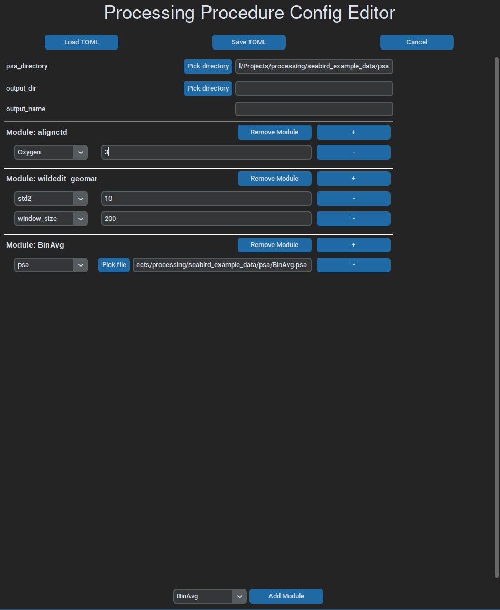

Usage
=====

Installation
------------

This software can be used in a few different ways. To run processing workflows,
called 'procedures', there is a command line cli, that resides in main.py and
runs workflow files on given CTD data files.

The easiest way to install CLI interface called 'ctdam' is to use `uv <https://docs.astral.sh/uv/>`_ or  `pipx <https://pipx.pypa.io/stable/>`_:

.. code-block:: console

    $ uv tool install --from 'ctdam[all]' ctdam

    $ uv run ctdam check
    All set, you are ready to go.

.. code-block:: console

    $ pipx install ctdam

    $ ctdam check
    All set, you are ready to go.

Otherwise, via basic python package managers, like pip, conda or poetry:

.. code-block:: console

    # using pip
    $ python -m venv .venv
    $ source .venv/bin/activate
    $ pip install ctdam
    $ python src/ctdam/entry/cli.py check
    All set, you are ready to go.

    # using poetry
    $ poetry install
    $ poetry env activate
    $ ctdam check
    All set, you are ready to go.

CLI
---

The CLI 'ctdam' should be the main entry point to the software. It allows
running and editing of procedure workflows. It features the following commands:

.. code-block:: console

    $ ctdam --help

    Usage: ctdam [OPTIONS] COMMAND [ARGS]...

    ╭─ Options ──────────────────────────────────────────────────────────────────────────────────────────────╮
    │ --verbose             -v        Enable verbose output.                                                 │
    │ --install-completion            Install completion for the current shell.                              │
    │ --show-completion               Show completion for the current shell, to copy it or customize the     │
    │                                 installation.                                                          │
    │ --help                          Show this message and exit.                                            │
    ╰────────────────────────────────────────────────────────────────────────────────────────────────────────╯
    ╭─ Commands ─────────────────────────────────────────────────────────────────────────────────────────────╮
    │ run      Processes one target file using the given procedure workflow file.                            │
    │ convert  Converts a list of Sea-Bird raw data files (.hex) to .cnv files.                              │
    │          Does either use an explicit list of paths or searches for all .hex files in                   │
    │          the given directory.                                                                          │
    │ batch    Applies a processing config to multiple .hex or. cnv files.                                   │
    │ edit     Opens a procedure workflow file in GUI for editing.                                           │
    │ show     Display the contents of a procedure workflow file.                                            │
    │ plot     Plot a cnv file.                                                                              │
    │ vis      Create a main html that incorporates the individual .html plots.                              │
    │ check    Assures that all requirements to use this tool are met.                                       │
    │ log      Prints the last x entries of the log file.                                                    │
    │ version  Displays the version number of this software.                                                 │
    ╰────────────────────────────────────────────────────────────────────────────────────────────────────────╯

The top three commands are the commands to run processing workflows, while the
other ones are for editing workflow files and plotting. In general, their
description should be self-explanatory.

To get more specific information to the individual commands and their arguments,
you can display help sites for each of them:

.. code-block:: console

    $ ctdam batch --help

    Usage: ctdam batch [OPTIONS] INPUT_DIR CONFIG

    Applies a processing config to multiple .hex or. cnv files.

    ╭─ Arguments ────────────────────────────────────────────────────────────────────────────────────────────╮
    │ *    input_dir      TEXT  The data directory with the target files. [required]                         │
    │ *    config         TEXT  Either an explicit config as dict or a path to a .toml config file.          │
    │                           [required]                                                                   │
    ╰────────────────────────────────────────────────────────────────────────────────────────────────────────╯
    ╭─ Options ──────────────────────────────────────────────────────────────────────────────────────────────╮
    │ --pattern  -p      TEXT  A name pattern to filter the target files with. [default: .hex]               │
    │ --help                   Show this message and exit.                                                   │
    ╰────────────────────────────────────────────────────────────────────────────────────────────────────────

Processing workflows
-----

The workflow files configure everything needed to run a processing procedure and are easy to understand and write.

Another way is to run processing procedures directly from your python code,
using either workflow files or the fact that these workflows correspond to a
basic python dictionary internally. This allows for quick scripts that can use
flexible input variables.

.. code-block:: python

   from ctdam import process

    proc_config = {
        "output_dir": "path_to_output",
        "modules": {
            "air_correction": {},
            "wildedit": {"std1": 3.0, "window_size": 100},
            "celltm": {},
        },
    }

    process('path_to_data', other_settings=proc_config)

The full list of options for running processing procedures, can be obtained
from its docstring:

.. autoclass:: ctdam.proc.workflow.Workflow
   :undoc-members:

Workflow files
--------------

The workflow dictionary used in the example above corresponds to this .toml workflow file:

.. code-block:: toml

    # example_config.toml

    output_dir = "path_to_output"

    [modules.datcnv]

    [modules.wildedit_geomar]
    std1 = 3.0
    window_size = 100

    [modules.celltm]

It does not matter, which way you provide the processing workflow information,
the two above examples work in exactly the same way. The different options
available and how to use them, are shown below:

.. literalinclude:: ../proc_template.toml
   :language: toml
   :caption: proc_template.toml

.. tip:: The only mandatory option is the **modules** dictionary, describing the steps to run on the file(s). All other options are optional.

A simple gui can be used to write and edit workflow files,
which, at the moment, is run like this:

.. code-block:: console

    ctdam edit example_config.toml

.. note:: All options for the Procedure class can be found :doc:`here <source/ctdam.proc.procedure>`.
